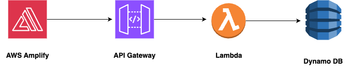
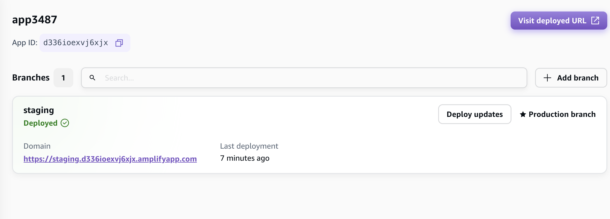
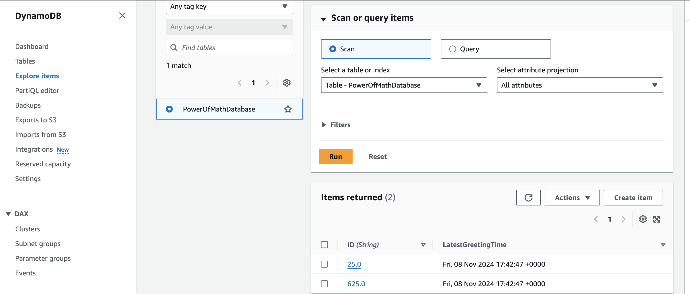
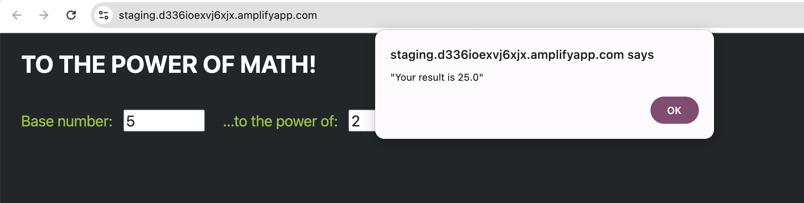

This is a project which connects 

AWS Amplify --> API Gateway --> Lambda --> Dynamo DB

very simple!

AWS Amplify

just upload the index.html file to AWS amplify and it will deploy it to AWS. It's simple like that!

in the index.html file there is an API Call which is set up by API Gateway

Lambda 

the function is just a way to use math function and it pushes the result to Dynamo db

It is triggered by API which is ran through index.html file

Ampify 

Final UI

Entry in Dynamo DB - Results will be stored in dynamo db 

Result as seen on UI
